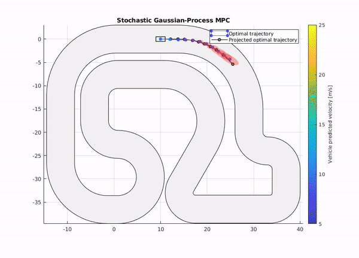

# Gaussian-Process-based-Model-Predictive-Control
Project for the course "Statistical Learning and Stochastic Control" at University of Stuttgart

Supported Matlab Version **>= R2019a**

## Control of an Inverted Pendulum with deffect motor

To run the Inverted Pendulum please execute
> main_invertedPendulum.m

## Control of a Race Vehicle with unkown true dynamics

To run the Race Car example execute:
> main_singletrack.m

