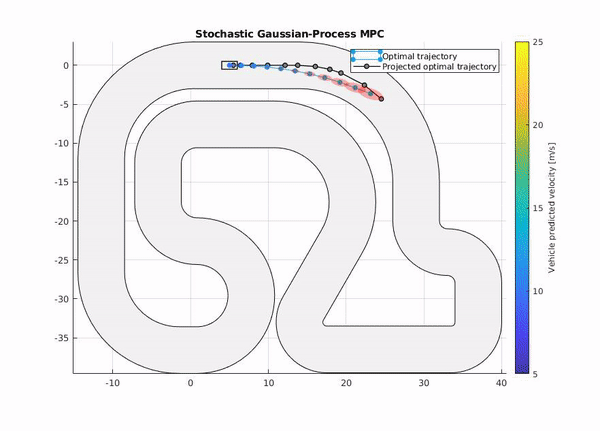

# Gaussian-Process based Model Predictive Control [IN PROGRESS]
Project for the course "Statistical Learning and Stochastic Control" at University of Stuttgart


For detailed information about the project, please refer to the [Presentation](./Presentation.pdf) and [Report](./Report.pdf).

Supported Matlab Version **>= R2019a**


## Control of a Race Vehicle with unkown complex dynamics

To run the Race Car example execute:
> main_singletrack.m

<br>

A Gaussian process is used to learn unmodeled dynamics
```math
    x_{k+1} = f_d(x_k,u_k) + B_d * ( GP(z_k) + w )

    , where z_k = [Bz_x*xk ; Bz_u*uk] is the vector of selected features
            f_d is the dicrete nominal model
            w ~ N(0,\sigma_n) is the process WG noise
            GP is the Gaussian Process model reponsible for learning the unmodeled dynamics

```
The Gaussian Process model GP is then fed with data (X,Y+w) collected online, such that:
```math
    X = [x_k,u_k]
    Y + w = pinv(B_d) * ( x_{k+1} - f_d(x_k,u_k) )
```
and it is trained (hyperparameter optimization) by maximizing the log Likelihood p(Y|X,theta), where theta is the vector of hyperparameters.


### Results


| NMPC controller with unmodelled dynamics        | Learning-Based NMPC controller (with trained Gaussian Process)         |
| ------------- |-------------|
|       |     |

<br>

## Control of an Inverted Pendulum with deffect motor

To run the Inverted Pendulum please execute
> main_invertedPendulum.m
